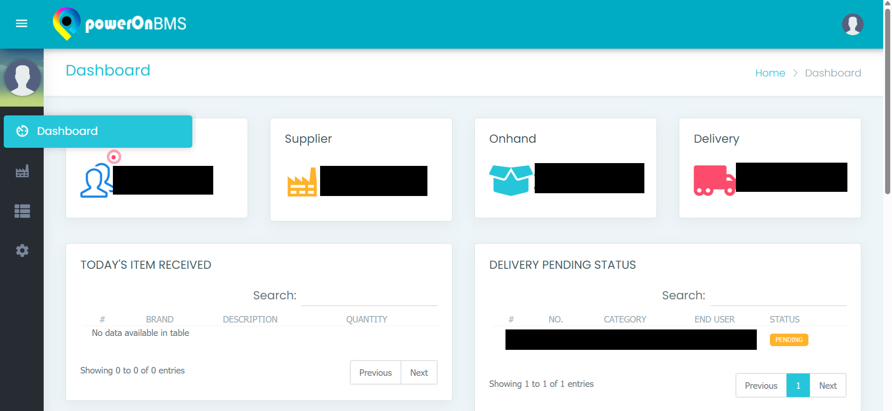

# PowerOn BMS

A robust, enterprise-grade Business Management System built with PHP (CodeIgniter) and MySQL. This tool is designed to streamline complex operational workflows for **Power On Enterprise Co.**, handling inventory tracking, purchase order management, supplier coordination, and granular user access control.

## 📋 Features (Meeting Requirements)

### Core Functionality
* **Dynamic Dashboard:** Real-time visual cards for Suppliers, On-hand Inventory, and Delivery stats. Includes tables for "Today's Items Received" and "Delivery Pending Status" for immediate operational awareness.
* **Inventory Management:** Comprehensive tracking of on-hand items, including Brand Name, Sub-Class (e.g., IT Accessories), Quantity, and real-time Stock Status.
* **Purchase Order (PO) System:** Manages supplier orders with tracking for Payment Terms (e.g., CASH), Classifications, and Status (OPEN/CANCELLED).
* **Delivery Tracking:** Detailed logging of delivery receipts, end-users, and status updates (Pending vs. Delivered).

### 🌟 Bonus Features Implemented
1.  **Granular Permission Control:** Administrators can assign specific access rights per user role (e.g., IT Analyst, Accounting). This includes "Allow" or "Deny" permissions for specific tabs like Supplier, Manage, or Inventory.
2.  **Audit Logging:** A robust `System Logs` module that records every user transaction (Login, Update, Create), complete with the specific message, IP Address, and Timestamp for security compliance.
3.  **Role-Based Access Control (RBAC):** Supports distinct account types including Manager, Accounting, Admin Staff, IT Analyst, and Purchaser.
4.  **Secure Authentication:** Includes a dedicated Login Portal and a "Change Password" facility for user account security.

## 📸 Screenshots

| **Login Portal** | **Dashboard** |
|:---:|:---:|
|  |  |

| **Inventory Management** | **System Logs** |
|:---:|:---:|
|  |  |

| **Permission Assignment** | **User Management** |
|:---:|:---:|
|  |  |

## 🛠️ Installation

1.  **Prerequisites:**
    * PHP 7.4 or higher (Compatible with PHP 8.x).
    * MySQL Database.
    * Apache Server (via XAMPP/WAMP).

2.  **Install Dependencies:**
    ```bash
    # Ensure mysqli extension is enabled in php.ini
    # Ensure mod_rewrite is enabled in Apache
    ```

## 📝 Limitations & Assumptions
1.  **Local Environment:** The system assumes a standard XAMPP/WAMP environment. Base URL configuration must match the local folder structure.
2.  **Database Import:** The application does not automatically create the database; the SQL file must be manually imported via phpMyAdmin.
3.  **Browser Compatibility:** Optimized for Chrome/Edge; heavily reliant on JavaScript/jQuery for dynamic table rendering.

## 🚀 How to Run

1.  Clone this repository.
2.  **Configuration Step:**
    * Open `application/config/database.php` and update credentials.
    * Open `application/config/config.php` and set the `$config['base_url']`.
3.  **Manual Database Step:**
    * Open **phpMyAdmin** and create a database named `poweron_db`.
    * **Action Required:** Click "Import" and select the provided `poweron.sql` file from the `database/` folder.
4.  Launch the application:
    ```bash
    # Open browser and navigate to:
    http://localhost/poweron
    ```

## 📂 Data Structure

The system is architected around specific user roles. Here is the JSON structure for the permission logic:

```json
{
    "User_Roles": [
        {
            "Role": "SuperUser / Manager",
            "Access": "Full System Access + User Management"
        },
        {
            "Role": "Accounting",
            "Access": "Financials, PO Management (Agency/Distributor)"
        },
        {
            "Role": "IT Analyst",
            "Access": "Inventory, On-hand Items, System Logs"
        },
        {
            "Role": "Purchaser",
            "Access": "Supplier List, Purchase Orders"
        }
    ]
}
